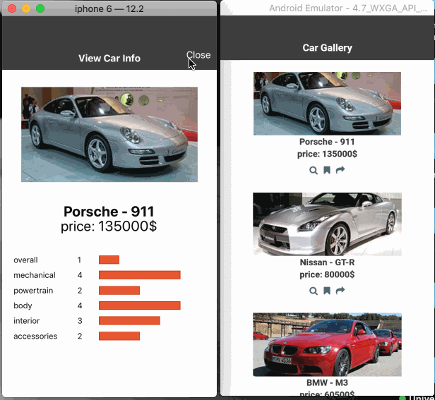

# AnimationExampleInReactNative

This is a **React Native** application.\
I implemented this application only to get familiar with **Animation** in **React Native**.


This project implemented according to below tutorials:
* [Adding animations to your React Native app – Part 1: Basic animations](https://blog.pusher.com/animation-react-native-part-1/) 
* [Adding animations to your React Native app – Part 2: Transition animations](https://blog.pusher.com/animation-react-native-part-2/)


react & react-native versions:
```$xslt
react: 16.8.6,
react-native: 0.60.4,
```

Tested on : **iOS** & **Android**


#### application without animation
This application shows list of cars and their rated specifications.\
**(all cars information are filled randomly and are not real)**


-----------

#### scale animation


Each card in list become animated.\
When press in a card, it scale 1.2 time bigger than normal and when press out it become to normal scale .


-----------

#### rotate animation

The action icons of each card in list become animated.\
When an action icon press in, rotated 360 degree clockwise and when press out rotated 360 degree counterclockwise.


-----------

#### spring animation

The appearance of information page for each car is animated.\
When search icon in action icons press, the information page transmit from down of the page to its position with spring effect 
and when closing information page, it transmit to down until disappear from screen.


-----------

#### width animation

The width of car rated specifications in information page are animated.\
When information page appeared, width of each specifications are animated from zero to their amount.




-----------

#### sequence animation

This part implemented in information page of each car and has three animation that are sequenced:
* fade in the image of car
* transmission of car name and price from top of page to their position
* increase scale of  car name and price to their original scale

> the initial status of this animation)
> * image of car is hidden (zero opacity)
> * car name and price are shrink and transmit to upper of screen


-----------

### header scroll animation

A header banner added to top of scroll View and animated when scrolling down.\
When scrolling down, the height of header shrink and the image of header fade out and vanished. the title of header shrink too, but persist in header bar.


------------